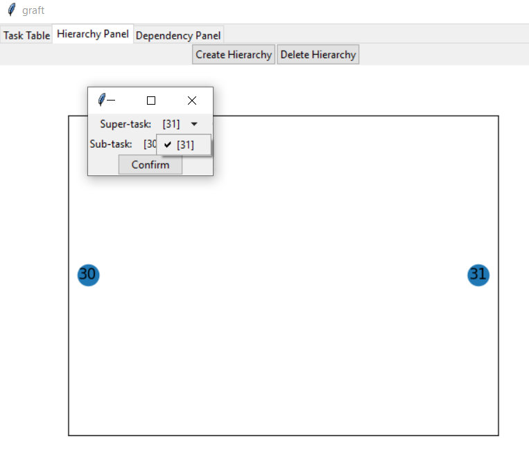

# Summary
When attempting to select the tasks to link in the 'add hierarchy' popup, once you click away from the starting task, it does not appear in the dropdown and you can't reselect it.

# Steps to reproduce
Commit SHA: 9cc208d1288d89dd3539b5e3292e333ee92de084
1. Return application to blank state
2. Add a task (task1)
3. Add a task (task2)
4. Navigate to the hierarchy tab
5. Click the 'add hierarchy' button
6. Observe that task1 is autoselected for supertask and ubtask
7. Click on the dropdown and select task2
8. Click on the dropdown
Observe the defective behaviour

# Artefacts
