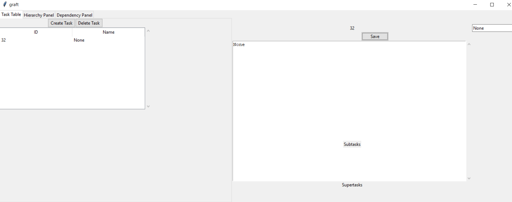

# Summary
The name/description of tasks is being set to 'None' unintentionally, when it should just be showing nothing

# Steps to reproduce
Commit SHA: 844d02fd46bfcf0b0f637220cf47477877989b39
1. Return application to blank state
2. Add a task, no name or description
3. In the 'task' tab, select the task
4. Observe the task appears in the right-hand panel, with both name and description as 'None'
5. Click 'Save' in the right-hand panel
6. Observe that the name and description of the task are now 'None'

# Artefacts
