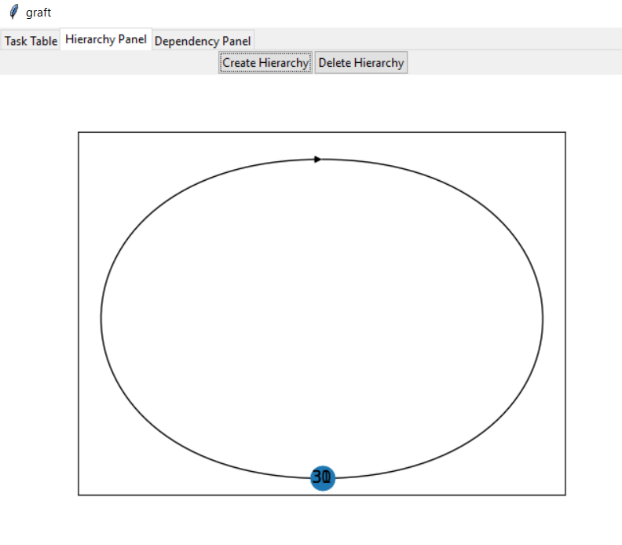

# Summary
When there are two tasks with a single hierarchy between them, the hierarchy graph shows the two nodes as overlapping, with the hierarchy a circle

# Steps to reproduce
Commit SHA: 9cc208d1288d89dd3539b5e3292e333ee92de084
1. Return application to blank state
2. Add a task (task1)
3. Add a task (task2)
4. Navigate to the hierarchy graph tab
5. Add a hierarchy from task1 to task2
Observe the defective behaviour

# Artefacts
